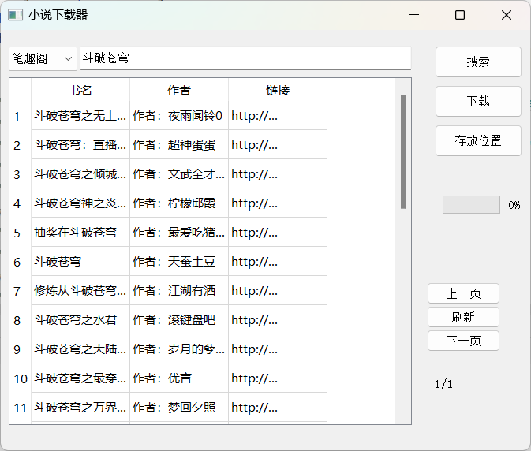

# pyqt5_novel
小说爬取 
This project is a simple pc reading tools.In the near future, we will complete the functions of this application.
## 文件介绍
novel.ui文件为软件ui架构，整个软件架构由pyqt5完成，界面简洁易用。 
novel2需配合ui文件使用，生成的novel2.exe需和ui在同一个文件夹中
novel3可以单独使用

